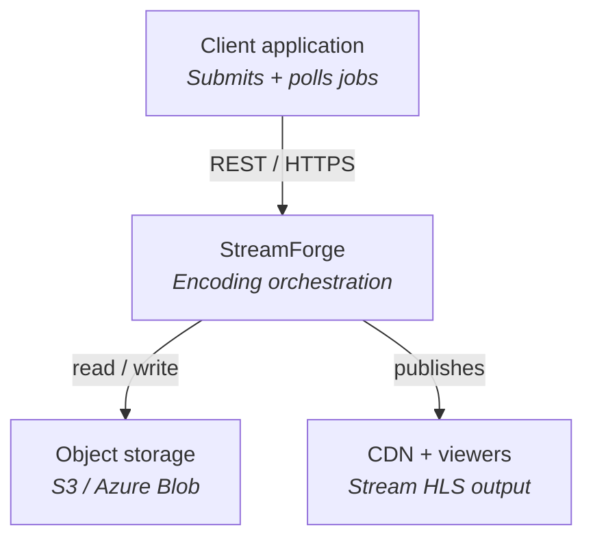
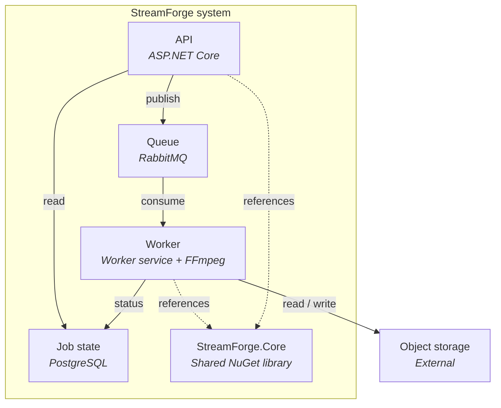
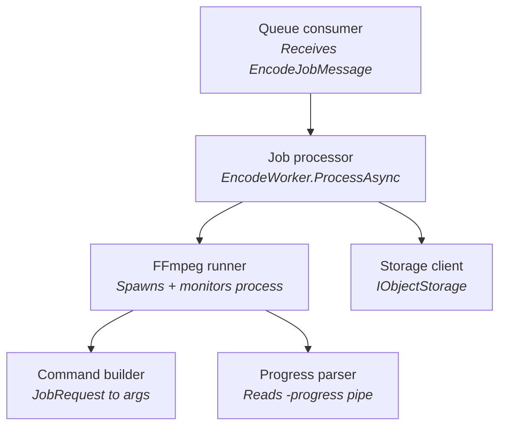
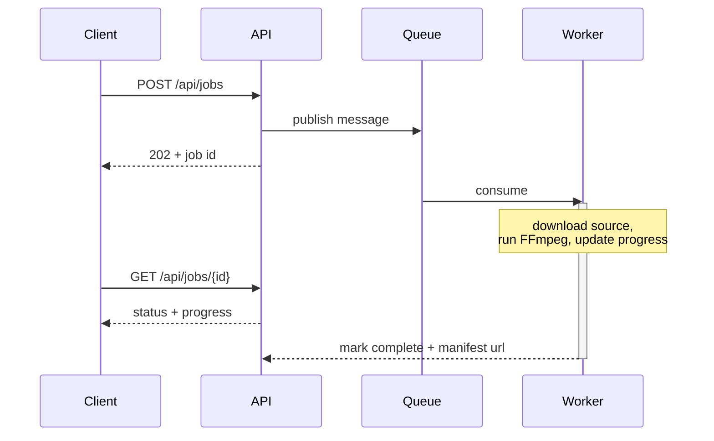

# StreamForge — C4 model

This document describes the architecture of StreamForge using the
[C4 model](https://c4model.com/) (Context, Containers, Components, Code). For an MVP
the Context and Container levels carry the most value; a Component sketch for the
worker is included because that is where the real complexity lives.

The diagrams below use Mermaid, which GitHub renders natively. Static SVG copies live
alongside this file in `docs/diagrams/`.

---

## Level 1 — System context

StreamForge is a single system that turns submitted source video into adaptive HLS
output. A client application submits and polls jobs; the system reads from and writes
to cloud object storage; viewers stream the output via a CDN.

---

## Level 2 — Containers

Opening the system box reveals four deployable units plus the shared library. The API
accepts jobs and publishes messages; the queue decouples submission from processing; the
worker runs FFmpeg; PostgreSQL holds job state. All reference `StreamForge.Core`.

---

## Level 3 — Worker components

The worker is the only container with non-trivial internal structure. A queue consumer
hands each message to a job processor, which orchestrates the storage client, the FFmpeg
command builder, the FFmpeg runner, and the progress parser.

---

## Job lifecycle sequence

The time-ordered interaction from submit to completion, including the client's status
polling loop running concurrently with encoding.

---

## Notes on the model

- The Context and Container levels are the durable documentation; keep them in sync with
  reality. The Component level is illustrative and will drift fastest — treat it as a
  sketch, not a contract.
- `StreamForge.Core` deliberately has no dependency on the API, worker, queue, or any
  cloud SDK. That keeps the encoding logic unit-testable and reusable.
- Object storage and the CDN are external systems in the C4 sense: StreamForge depends on
  them but does not own them.
